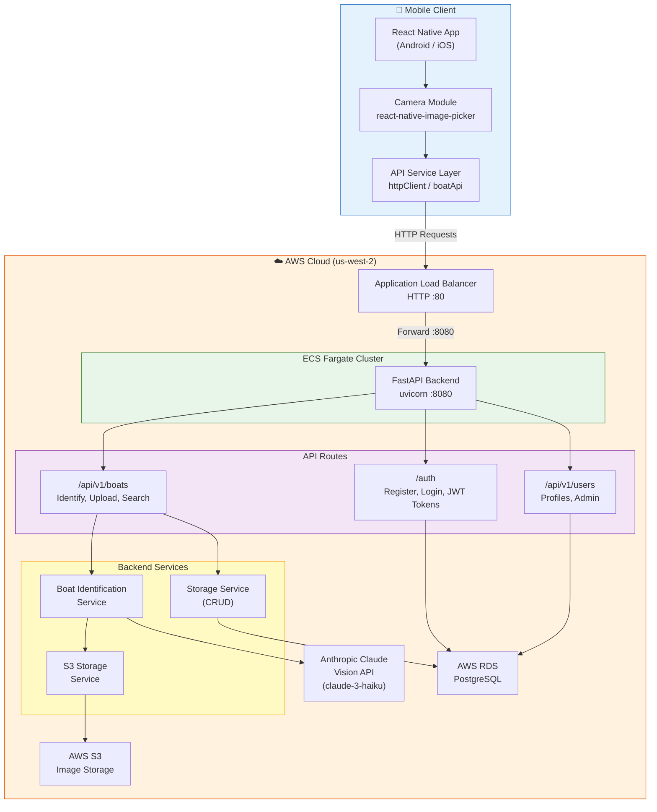

# 🚤 BoatID

BoatID is a mobile application that identifies boats from photos using AI. Take a picture of any boat with your phone, and the app will analyze the image to determine its make, model, type, and other details.

## Overview

- **Frontend**: React Native mobile app (Android/iOS) with camera integration
- **Backend**: FastAPI service deployed on AWS Fargate behind an Application Load Balancer
- **AI**: Anthropic Claude Vision (claude-3-haiku) for boat image analysis
- **Storage**: AWS S3 for images, PostgreSQL (RDS) for identification results and user data

## 🏗️ Architecture



## 📁 Project Structure

| Directory | Description |
|-----------|-------------|
| `frontend/` | React Native mobile app (TypeScript) |
| `backend/` | FastAPI backend service (Python) |
| `infrastructure/` | Terraform IaC definitions |
| `data/` | Sample CSV data and images |
| `scripts/` | Utility scripts |

## 🚀 Getting Started

### Backend

```bash
cd backend
pip install -r requirements.txt
python deploy_fargate.py   # Deploy to AWS Fargate with ALB
```

### Frontend

```bash
cd frontend
npm install

# Build Android APK (run as separate commands in PowerShell)
npx react-native bundle --platform android --dev false --entry-file index.js --bundle-output android/app/src/main/assets/index.android.bundle --assets-dest android/app/src/main/res
cd android; .\gradlew assembleDebug
```
