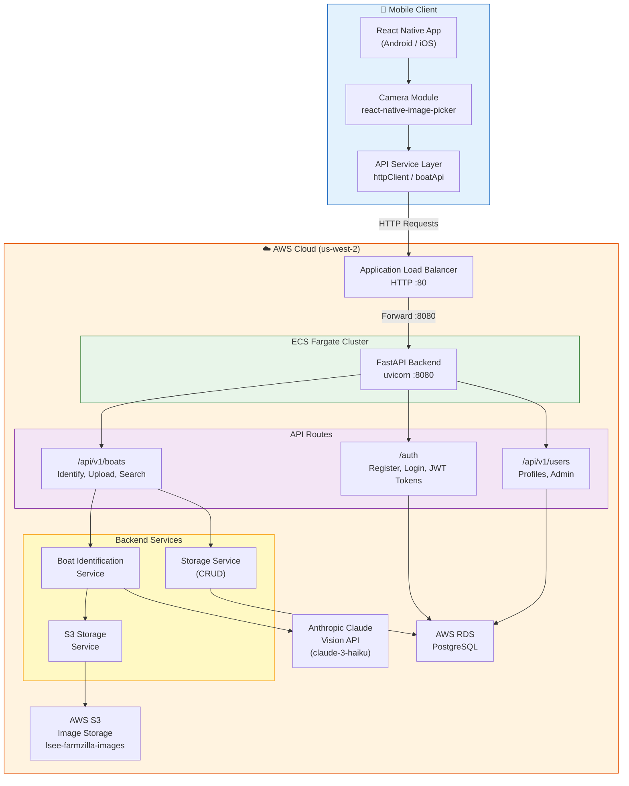

    npm # BoatId Mobile                                                                                                                                                                                                                                                                                                                                                                                                                                                                                                                                                                                                                                                                                                                                                                                                                                                                                                                                                                                                                                                                                                                                                                                                     
A React Native application for boat identification and cataloging.

## 🚤 Features

- **Clean Hello World Interface**: Professional welcome screen with interactive features
- **Modular Component Architecture**: Reusable components for scalable development
- **Dark/Light Mode Support**: Automatic theme switching based on device settings
- **Interactive Feature Demos**: Clickable feature items with placeholder functionality
- **TypeScript Support**: Full TypeScript integration for type safety
- **Cross-Platform**: Supports both iOS and Android

## 📱 Current Functionality

### Components
- **WelcomeCard**: Displays app introduction and description
- **FeatureItem**: Interactive feature showcase items
- **Button**: Reusable button component with multiple variants
- **Config**: Centralized app configuration

### Features Ready for Development
- ✅ Camera Integration (placeholder)
- ✅ Boat Identification (placeholder)
- ✅ Data Storage (placeholder)
- ✅ User Authentication (placeholder)

## 🛠 Development Setup

### Prerequisites
- Node.js 18+
- React Native 0.84.0
- Android Studio (for Android development)
- Xcode (for iOS development, macOS only)

### Installation
```bash
cd frontend
npm install
```

### Running the App
```bash
# Start Metro bundler
npm start

# Run on Android
npm run android

# Run on iOS (macOS only)
npm run ios
```

## 📁 Project Structure

```
frontend/
├── src/
│   ├── components/          # Reusable UI components
│   │   ├── WelcomeCard.tsx
│   │   ├── FeatureItem.tsx
│   │   ├── Button.tsx
│   │   └── index.ts
│   └── config/              # App configuration
│       └── index.ts
├── App.tsx                  # Main application component
├── index.js                 # App entry point
└── package.json
```

## 🎨 Design System

### Colors
- **Primary**: #2196f3 (Blue)
- **Secondary**: #1976d2 (Dark Blue)
- **Background Light**: #f8f9fa
- **Background Dark**: #1a1a1a

### Typography
- **Title**: 36px, Bold
- **Subtitle**: 16px, Italic
- **Feature Text**: 16px, Medium

## 🚀 Next Steps

This hello world app provides a solid foundation for building the complete BoatId application. The next development phases will include:

1. **Camera Integration**: React Native Camera setup
2. **Backend API Connection**: Connect to FastAPI backend
3. **Authentication Flow**: Login/register screens
4. **Boat Database**: CRUD operations for boat data
5. **Image Upload**: S3 integration for image storage

## 📄 License

This project is part of the BoatId application suite.

## 🏗️ Architecture



## Step 2: Build and run your app

With Metro running, open a new terminal window/pane from the root of your React Native project, and use one of the following commands to build and run your Android or iOS app:

### Android

```sh
# Using npm
npm run android

# OR using Yarn
yarn android
```

### iOS

For iOS, remember to install CocoaPods dependencies (this only needs to be run on first clone or after updating native deps).

The first time you create a new project, run the Ruby bundler to install CocoaPods itself:

```sh
bundle install
```

Then, and every time you update your native dependencies, run:

```sh
bundle exec pod install
```

For more information, please visit [CocoaPods Getting Started guide](https://guides.cocoapods.org/using/getting-started.html).

```sh
# Using npm
npm run ios

# OR using Yarn
yarn ios
```

If everything is set up correctly, you should see your new app running in the Android Emulator, iOS Simulator, or your connected device.

This is one way to run your app — you can also build it directly from Android Studio or Xcode.

## Step 3: Modify your app

Now that you have successfully run the app, let's make changes!

Open `App.tsx` in your text editor of choice and make some changes. When you save, your app will automatically update and reflect these changes — this is powered by [Fast Refresh](https://reactnative.dev/docs/fast-refresh).

When you want to forcefully reload, for example to reset the state of your app, you can perform a full reload:

- **Android**: Press the <kbd>R</kbd> key twice or select **"Reload"** from the **Dev Menu**, accessed via <kbd>Ctrl</kbd> + <kbd>M</kbd> (Windows/Linux) or <kbd>Cmd ⌘</kbd> + <kbd>M</kbd> (macOS).
- **iOS**: Press <kbd>R</kbd> in iOS Simulator.

## Congratulations! :tada:

You've successfully run and modified your React Native App. :partying_face:

### Now what?

- If you want to add this new React Native code to an existing application, check out the [Integration guide](https://reactnative.dev/docs/integration-with-existing-apps).
- If you're curious to learn more about React Native, check out the [docs](https://reactnative.dev/docs/getting-started).

# Troubleshooting

If you're having issues getting the above steps to work, see the [Troubleshooting](https://reactnative.dev/docs/troubleshooting) page.

# Learn More

To learn more about React Native, take a look at the following resources:

- [React Native Website](https://reactnative.dev) - learn more about React Native.
- [Getting Started](https://reactnative.dev/docs/environment-setup) - an **overview** of React Native and how setup your environment.
- [Learn the Basics](https://reactnative.dev/docs/getting-started) - a **guided tour** of the React Native **basics**.
- [Blog](https://reactnative.dev/blog) - read the latest official React Native **Blog** posts.
- [`@facebook/react-native`](https://github.com/facebook/react-native) - the Open Source; GitHub **repository** for React Native.
